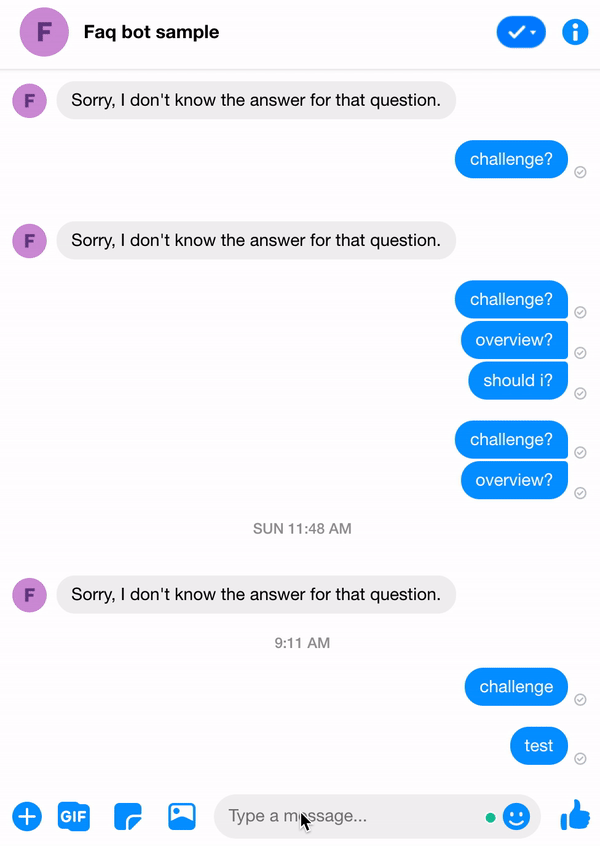

# FAQ-bot

## 🇮🇩 Versi Indonesia

FAQ-bot adalah bot messenger yang membantu pagemu menjawab pertanyaan-pertanyaan yang sering dilontarkan oleh pengguna.

Bot ini dibuat untuk mengikuti [Facebook developer circle community challenge 2020](https://developercircles2020.devpost.com/). Isi dari botnya dirancang agar menjawab pertanyaan-pertanyaan yang sering dilontarkan tentang challenge tersebut.

Karena bot ini belum dirilis, kalau kamu ingin mencoba sample dari FAQ-bot [https://m.me/askmeforfaq](https://m.me/askmeforfaq),
kamu bisa menghubungi kita untuk meminta aksesnya.

### Daftar Tutorial

1. [Cara membuat FAQ-bot langkah demi langkah.](docs/id/cara-membuat-faq-bot.md)

2. [Cara menggunakan (kontribusi, menjalankan, dll).](docs/id/cara-menggunakan.md)

## 🇬🇧 English Version

FAQ-bot is bot messenger that helps your page to answer frequently asked questions (FAQ) by user.

This bot is made to join [Facebook developer circle community challenge 2020](https://developercircles2020.devpost.com/). The contents is designed to answer the freqeuently asked questions (FAQ) about Facebook developer circle community challenge 2020.

Because this bot isn't published yet, if you want to try the FAQ-bot sample [https://m.me/askmeforfaq](https://m.me/askmeforfaq), you can contact us to request for access.

### Tutorial

1. [How to create FAQ-bot step by step](docs/en/how-to-make-faq-bot.md)

2. [How to use (contribute, running, etc).](docs/en/how-to-use.md)

# Author

[Ali Qornan](https://github.com/qornanali)
[Muhammad Jafar](https://github.com/mhmmdjafarg)

📌 Bandung, Indonesia

[Linkedin](https://linkedin.com/in/aliqornan) | [Blog](https://medium.com/@aliqornan97)
