# :gb: How to make `FAQ-BOT` your smart assistant to answer questions

## Introduction

Before we start doing something, we should start with _why?_. And in this section, it'll explain to you _why?_ FAQ-Bot made.

### Why do we need this bot? 🤔

When we make a product, we want our customers or users can use it as we wish. However, along with the development of this product, the more information is spread widely and make our customers lose their way.

To solve that, FAQ was created. FAQ stands for Frequently Asked Question, FAQ is a list of questions that most often asked from customer or user about a certain topic along with the answer.

To increase the quality of FAQ, as a producer we should be able to answer the following question :

- Is the answer appropriate to customer?
- What other questions do customers often ask?

### What is the solution? 🙋‍♂️

As we know, Facebook _messenger-platform_ has released an API that we can use to create a smart virtual assistant.
This smart virtual assistant automatically reply to the messages from the costumers.
This assistant can also be integrated with _wit.ai_ in order to make it easier to understand what customers saying.

By using the features, we are going to make a bot in messenger that able to understand the question from customers.
Then, we will process the question to provide an appropriate answer.

## Table of Contents

- [Introduction](#introduction)
  * [Why do we need this bot? 🤔](#why-do-we-need-this-bot-)
  * [What is the solution? 🙋‍♂️](#what-is-the-solution-%EF%B8%8F)
- [Table of Contents](#table-of-contents)
- [Analyze app that we're going to make](#analyze-app-that-were-going-to-make)
  * [Defines the scope 🔍](#defines-the-scope-)
  * [Find out the technology needed 💻](#find-out-the-technology-needed-)
    + [Create messenger app](#create-messenger-app)
    + [Train AI to understand chat](#train-ai-to-understand-chat)
  * [Conclusion](#conclusion)
    + [Facebook verifies the webhook](#facebook-verifies-the-webhook)
    + [Application receives a question from customer](#application-receives-a-question-from-customer)
    + [Application sends an answer to customer](#application-sends-an-answer-to-customer)
  * [Prerequisite 📦](#prerequisite-)
- [It's Time to Develop the App!](#its-time-to-develop-the-app)
  * [Project initialization 🧘‍♂️](#project-initialization-%EF%B8%8F)
    + [Create new rails project](#create-new-rails-project)
    + [Setting up a PostgreSQL Database](#setting-up-a-postgresql-database)
    + [Running web server](#running-web-server)
  * [Creating webhook 🕸](#creating-webhook-)
    + [Adding `/webhook` to route](#adding-webhook-to-route)
    + [Creating `GET /webhook` for token verification](#creating-get-webhook-for-token-verification)
    + [Creating `POST /webhook` to receives event](#creating-post-webhook-to-receives-event)
    + [Checking the webhook](#checking-the-webhook)
    + [Testing webhook in Facebook app](#testing-webhook-in-facebook-app)
  * [Reply message to customer 💬](#reply-message-to-customer-)
    + [Get token access from facebook page](#get-token-access-from-facebook-page)
    + [Add Faraday gem](#add-faraday-gem)
    + [Modify create function](#modify-create-function)
  * [Integrate chat with AI 🤖](#integrate-chat-with-ai-)
    + [Train AI Understanding in chat](#train-ai-understanding-in-chat)
    + [Change the app settings on Facebook](#change-the-app-settings-on-facebook)
    + [Modify create function](#modify-create-function-1)
  * [Send answer based on database](#send-answer-based-on-database)
    + [Change database scheme](#change-database-scheme)
    + [Creating the Answer model](#creating-the-answer-model)
    + [Modify private text_for_answer function](#modify-private-text_for_answer-function)
- [Closing](#closing)
  * [What's next?](#whats-next)
  * [Reference](#reference)

<small><i><a href='http://ecotrust-canada.github.io/markdown-toc/'>Table of contents generated with markdown-toc</a></i></small>

## Analyze app that we're going to make

The key of making high-quality applications is knowing the details. If we understand what we're doing, then
it would be effective and efficient in the development process since we already know the tech specifications we need
and what steps should be taken if errors/bugs occurs.

### Defines the scope 🔍

We need to define the scope so that in this app development we can focus on primary things.
The following is the diagram use case  : 

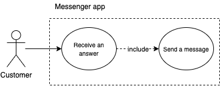

- Actor that ables to interact with the system is: 1) customer

- Costumer actor ables to 1) Send a message and 2) receive an answer.

### Find out the technology needed 💻

To know any specifications of the technology that we'll use,
We need to try making the simple version or we can say hello-world app.
The method we will use is _spike_[[2]].

#### Create messenger app

To make an application in messenger platform that could receive, read then answer the message,
we need to understand how the platform architecture works.
To understand that, we can directly go to short tutorial from messenger-platform through this link https://developers.facebook.com/docs/messenger-platform/getting-started.

#### Train AI to understand chat

To make the application understand the meaning of customer questions, we need to integrate AI.
We train this AI by giving samples from customer questions then we specify from each sample, what does customer mean.
To understand how, we can directly go to short tutorial from wit.ai through this link https://wit.ai/docs/quickstart.

### Conclusion

After doing spikes above, the following is diagram of the specifications technology that we'll use.
The diagram is made as simple as possible, so it may miss some information.
However, this should be enough to explain the high-level.

Each event conducted by the customers will be forwarded to the webhook that we have created.
On this webhook your application will receive, process, and response to the message sent by the customer
through Facebook page.

The webhook requirements are  :

- Supports HTTPS protocol

- Valid SSL certificate

- Open the port that ables to request `POST` and `GET`.

#### Facebook verifies the webhook


We need to save the webhook URL to settings in Facebook application.
When we save it, Facebook will send `GET` request which contains the verification process to make sure webhook requirements are met.

#### Application receives a question from customer

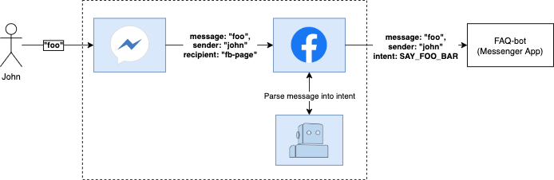

Facebook will sends `POST` request to the webhook URL that we already save on settings.
This request contain information such as ID from sender, text messages, time sent, etc.

#### Application sends an answer to customer

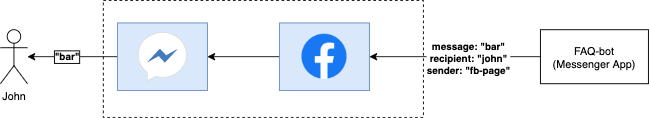

Our application will process a message corresponding to the logic we made.
After that, the application will answer the message from sender by sending `POST` request to Facebook Graph API.

### Prerequisite 📦

1. Ruby ~> 2.5 installed on your device.

You may use [rbenv](https://github.com/rbenv/rbenv#installing-ruby-versions)
or [rvm](https://rvm.io/rvm/install#try-out-your-new-rvm-installation), to install ruby version needed.

To check if your device has ruby installed, you can run the following command in terminal/command prompt: 

```console
$ ruby -v
# example: ruby 2.5.3p105 (2018-10-18 revision 65156) [x86_64-darwin18]
```
if your terminal sent back `ruby <xxx>` then it's ready to use.

2. Bundler ~> v2

To install, open terminal/command prompt then run the following:

```console
$ gem install bundler -v 2.0.2
```
To check if your device has bundler installed, you can run the following command in terminal/command prompt: 

```console
$ bundler -v
# example: Bundler version 2.1.4
```
if you see `Bundler version <xxx>` on your terminal then it's ready to use.

3. Rails ~> v6

To install, open terminal/command prompt then run the following:

```console
$ gem install rails -v 6
```

To check if your device has rails installed, you can run the following command in terminal/command prompt: 

```console
$ rails -v
# example: Rails 6.0.3.4
```

if you see `Rails <xxx>` on your terminal then it's ready to use.

4. Docker

You can install docker through this link: https://docs.docker.com/get-docker.

5. Facebook Developer account

Facebook developer account is required to make a new application, that is core of Facebook integration. 
You can open the link https://developers.facebook.com to create a new account.

6. Wit.ai account

This account is required to make NLP model[[1]], used to understand he user's question.
If you don't have one, click on the link to create new account https://wit.ai.

7. Ngrok account

This ngrok account is required to make https URL from your webserver to internet needed by Facebook
so that able to sends data to your webhook. You can create a new account by click the link https://ngrok.com.
Don't forget to follows the setup tutorial on https://dashboard.ngrok.com/get-started/setup.

## It's Time to Develop the App!

### Project initialization 🧘‍♂️

#### Create new rails project

Open terminal/cmd, get into your any directory then run the following command below:

```console
$ rails new my-faq-bot --force --api --skip-action-mailbox --skip-action-mailer --skip-active-storage --skip-system-test --skip-action-text --skip-javascript --skip-spring --skip-action-cable --no-skip-active-record --database=postgresql
```

This command will create a new folder named `my-faq-bot` contains the project template for REST API application.

#### Setting up a PostgreSQL Database

Get into your project directory, then create a new file named `docker-compose.yml` with the following code:

```yml
# <root_project_directory>/docker-compose.yml

version: '3'

services:
  postgres:
    image: postgres:11-alpine
    ports:
      - "5432:5432"
    environment:
      - POSTGRES_DB=faq-bot_development
      - POSTGRES_USER=postgres
      - POSTGRES_HOST_AUTH_METHOD=trust
```

Add key `username` and `host` in `config/databse.yml` file as the following:

```yml
# <root_project_directory>/config/database.yml

development:
  <<: *default
  database: faq-bot_development
  username: postgres
  host: localhost
```

Open terminal/cmd, then run the following command:

```console
$ docker-compose up -d
```

That command will run one PostgreSQL container that we can use as our database.

#### Running web server

Open terminal/cmd, get into your project directory then run the following command:

```console
$ bin/rails server -port 3000
```

The command above will run your project as web server on the port:3000.
Next open `http://localhost:3000` on your browser and make sure you see the page: "Yay! You’re on Rails!"

### Creating webhook 🕸

#### Adding `/webhook` to route

Go to your project directory, then add `webhook` resource in `config/routes.rb`.

```ruby
# <root_project_directory>/config/routes.rb

Rails.application.routes.draw do
  resource :webhook, only: [:show, :create]
end
```

To see if the URL works, open terminal/cmd, then run the following command:

```console
$ bin/rails routes

#  Prefix Verb URI Pattern        Controller#Action
# webhook GET  /webhook(.:format) webhooks#show
#         POST /webhook(.:format) webhooks#create
```

From the example result above, then:
- If there is request `GET /webhook` it should be routed to `WebhooksController` in a function `#show`.

- If there is request `POST /webhook` it should be routed to `WebhooksController` in a function `#create`.

#### Creating `GET /webhook` for token verification

Get into your project directory, then create a new file `webhooks_controller.rb` in `app/controllers/`.

```ruby
# <root_project_directory>/app/controllers/webhooks_controller.rb

class WebhooksController < ApplicationController
  def show
    mode = params['hub.mode']
    token = params['hub.verify_token']
    challenge = params['hub.challenge']

    if mode == 'subscribe' && token == 'foo'
      print 'WEBHOOK_VERIFIED'
      render json: challenge, status: :ok
      return
    end

    render json: 'FAILED', status: :forbidden
  end
end
```

#### Creating `POST /webhook` to receives event

Get into your project directory, then add a function `#create` in `WebhooksController`.

```ruby
# <root_project_directory>/app/controllers/webhooks_controller.rb

class WebhooksController < ApplicationController
  # show ..

  def create
    webhook_data = params['webhook'].as_json
    if webhook_data['object'] != 'page'
      render json: 'FAILED', status: :not_found
      return
    end

    entries = webhook_data['entry']
    entries.each do |entry|
      messaging = entry['messaging'].first
      print messaging['message']
    end
    render json: 'EVENT_RECEIVED', status: :ok
  end
end
```

#### Checking the webhook

To check if our webhook is successful, open terminal/cmd,
then [Running web server](#running-web-server),
after that run the following command to verify token:

```console
$ curl -X GET "localhost:3000/webhook?hub.verify_token=foo&hub.challenge=CHALLENGE_ACCEPTED&hub.mode=subscribe"
```

To know if our webhook successful, is you can check:

- if the contents of the query parameter `hub.verify_token` is equal to our specified token above,
then we expect webhook should sent back contents from query parameter `hub.challenge` and the status `200 ok`.

- There is message `WEBHOOK_VERIFIED` shows in console.

For events on the webhook, run the following command:

```console
$ curl -H "Content-Type: application/json" -X POST "localhost:3000/webhook" -d '{"object": "page", "entry": [{"messaging": [{"message": "TEST_MESSAGE"}]}]}'
```

We can check if our webhook successful is by seeing:

- if the contents from request body `object` is`page` then the expectations, webhook should send back
`EVENT_RECEIVED` and the status `200 ok`.

- There is message `TEST_MESSAGE` shows in console.

#### Testing webhook in Facebook app

As explained in [Conclusion](#conclusion), several requirements must be met so that we can put our webhook in the app configuration.
For now, since we are still in development stage, we can use a software named ngrok.
The steps are:

**1. Change app configuration**

Get into your project directory, then allow ngrok hostname in `config/environments/development.rb`
by adding `config.hosts << /[a-z0-9]+\.ngrok\.io/` as follos:

```ruby
# <root_project_directory>/config/environments/development.rb

Rails.application.configure do
  # configs ..

  config.hosts << /[a-z0-9]+\.ngrok\.io/
end
```

**2. Run web server**

Do as follows [this step](#running-web-server).

**3. Run ngrok**

Open a new tab in terminal/cmd, then run:

```console
$ ngrok http 3000
```

Example output:

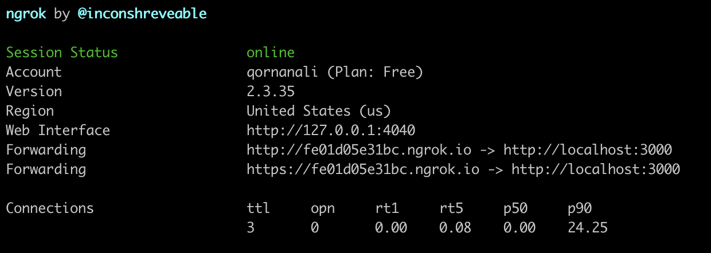

Get https URL from line `Forwarding` for example `https://fe01d05e31bc.ngrok.io`

**4. Save webhook URL in Facebook app configuration**

If you follow [this section](#create-messenger-app), then you should already have Facebook developer account
and ever made Facebook app. The next step is :

1. Open the settings page from Facebook app that you've made.

2. Get into `messenger > settings > webhooks`

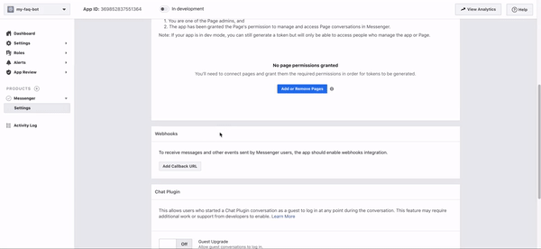

Add host and verify token according to the form in the image. For example, the url webhook is `https://fe01d05e31bc.ngrok.io/webhook`
and the token verification is `foo`.

3. Connect the bot with the Facebook page

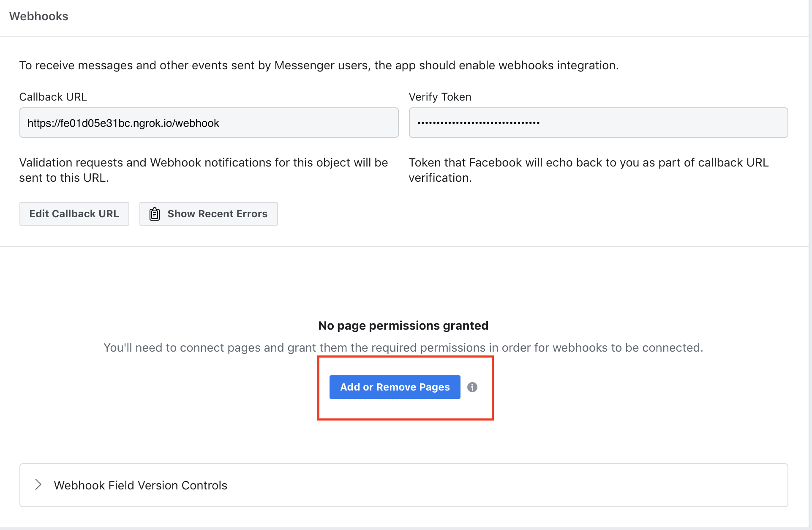

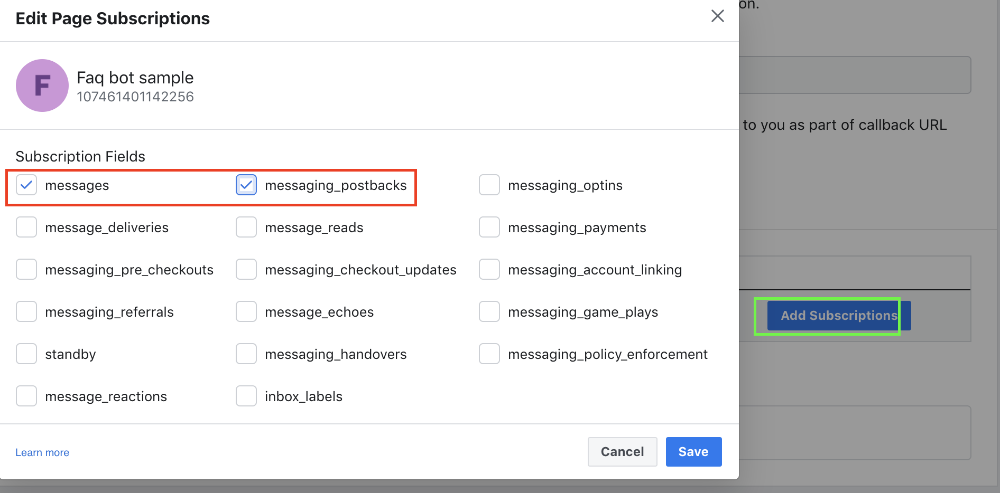

Add `messages` and `messaging_postback` as subcription settings.

4. Check if the configuration is correct like [this section](#checking-the-webhook) by sending message to Facebook page that you have chosen.

### Reply message to customer 💬

#### Get token access from facebook page

1. Open settings page from facebook app you've made.

2. Get into `messenger > settings > webhooks`

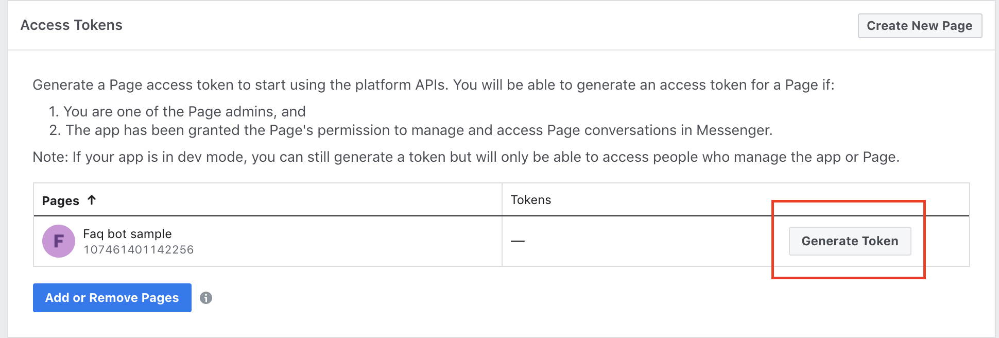

3. Get token from section `access tokens`

> :warning: Be careful with this token. Don't share with anyone, unless you believe to them. 

#### Add Faraday gem

Faraday is one of gem that serves as HTTP client.
Get into your project directory, then add Faraday `Gemfile`:

```ruby
# <root_project_directory>/Gemfile

gem 'faraday'
```

Open terminal/cmd, then run the following command:

```console
$ bundle install
```

#### Modify create function

Get into your project directory, then modify `#create` function in `WebhooksController`.

```ruby
# <root_project_directory>/app/controllers/webhooks_controller.rb

class WebhooksController < ApplicationController
  # show ..

  def create
    webhook_data = params['webhook'].as_json
    if webhook_data['object'] != 'page'
      render json: 'FAILED', status: 404
      return
    end

    entries = webhook_data['entry']
    entries.each do |entry|
      messaging = entry['messaging'].first
      message = messaging['message']
      sender_id = messaging['sender']['id']
      text_for_answer = message['text']
      send_message(sender_id, text_for_answer)
    end
    render json: 'EVENT_RECEIVED', status: 200
  end

  private

    def send_message(recipient_id, text)
      access_token = '<put your page access token>'
      request_url = URI("https://graph.facebook.com/v2.6/me/messages?access_token=#{access_token}")
      request_body = {
        recipient: {
          id: recipient_id
        },
        message: {
          text: text
        }
      }.to_json

      resp = Faraday.post(request_url, request_body, "Content-Type" => "application/json")
    end
end
```

After that, you can test by sending message to your facebook page.
Don't forget to make sure you have done [this section](#testing-webhook-in-facebook-app) and web server is already running.

### Integrate chat with AI 🤖

#### Train AI Understanding in chat

To understand the meaning of customer question, we can train our app so that it can
extract the meaning from the sentences based on how high the level of confidence.

If you have done [this section](#train-ai-to-understand-chat), then it should be similiar.
First thing first, we create an app in wit.ai. Next, get into understanding page.

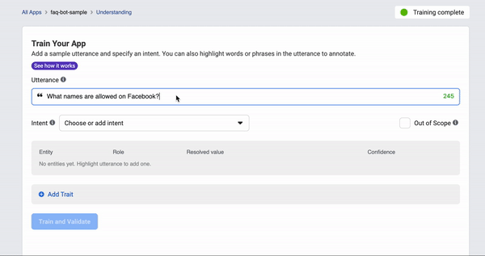

After that, entry utterances, select the entity and the intent. The more utterance sample are
used for this training, then the quality of level of confidence is way better.

#### Change the app settings on Facebook

1. Get access token from wit.ai account

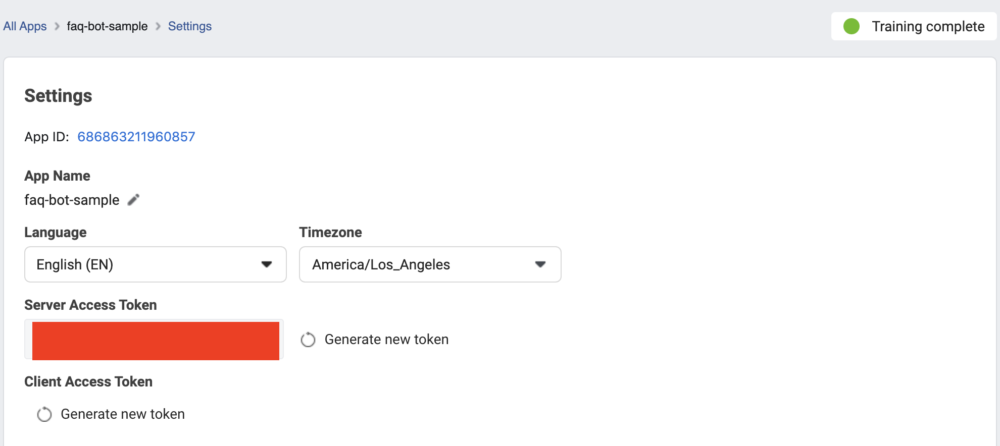

> :warning: Be careful with this token. Don't share it with anyone, unless you believe in them.

2. Open Facebook app settings page that you've made.

3. Get into `messenger > settings > Built-In NLP`

4. Select `Other Language Support`, then select `English`, afterward select `Custom`.
Next, enter the access token we got from wit.ai

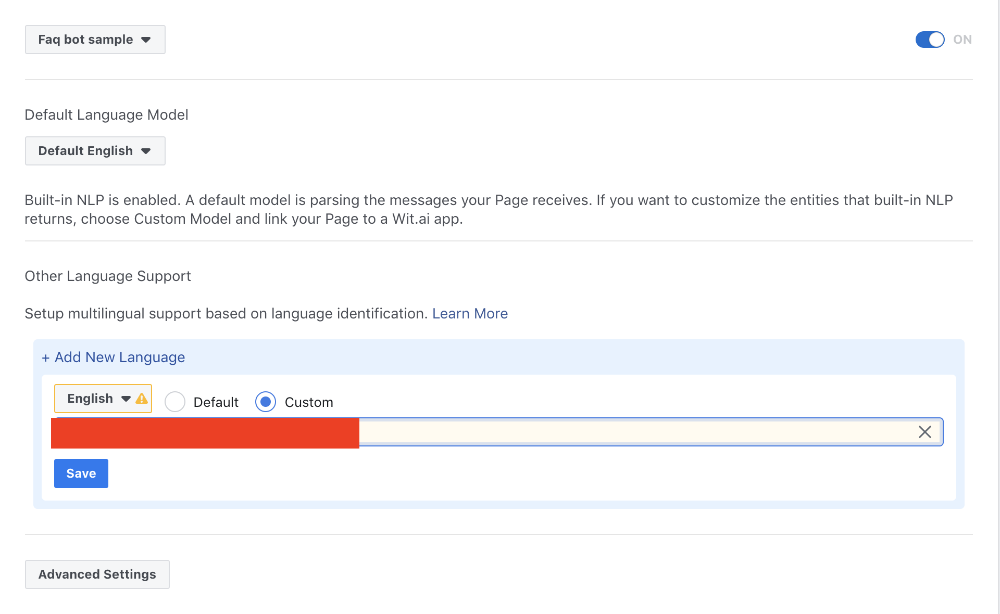

#### Modify create function

Get into your project directory, then modify `#create` function in `WebhooksController`.

```ruby
# <root_project_directory>/app/controllers/webhooks_controller.rb

class WebhooksController < ApplicationController
  # show ..

  def create
    webhook_data = params['webhook'].as_json
    if webhook_data['object'] != 'page'
      render json: 'FAILED', status: 404
      return
    end

    entries = webhook_data['entry']
    entries.each do |entry|
      messaging = entry['messaging'].first
      message = messaging['message']
      sender_id = messaging['sender']['id']
      send_message(sender_id, text_for_answer(message))
    end
    render json: 'EVENT_RECEIVED', status: 200
  end

  private

    # send_message ...

    def text_for_answer(message)
      selected_intents = message['nlp']['intents'].select { |item| item['confidence'].to_f > 0.5 }
      sorted_intents = selected_intents.sort_by { |item| -item['confidence'].to_f }
      intent = sorted_intents.first['name'] unless sorted_intents.empty?
      return 'You can put anyname on Facebook' if intent == 'allowed_name'

      message['text']
    end
end
```

After that, you can test by sending message to your facebook page.
Don't forget to make sure you have done [this section](#testing-webhook-in-facebook-app) and web server is already running.

### Send answer based on database

#### Change database scheme

Open terminal/cmd, get into any directory you want, then run the following commands:

```console
$ bin/rails generate migration CreateAnswers

# invoke  active_record
# create  db/migrate/20201025103252_create_answers.rb
```

These commands will create a new file that contains a script template to change the scheme on database.

Next, get into the new file that just generated before, for example `db/migrate/20201025103252_create_answers.rb`.
Then add the contents as follows:

```ruby
# <root_project_directory>/db/migrate/20201025103252_create_answers.rb

class CreateAnswers < ActiveRecord::Migration[6.0]
  def change
    create_table :answers do |t|
      t.string :question_type, null: false
      t.string :text, null: false

      t.timestamps
    end

    add_index :answers, :question_type, unique: true
  end
end
```

The script is used for adding a new table named `answers` 
that has column `question_type` with type : `string` , and `text` with type `string`.

Back into terminal/cmd, then run:

```console
$ docker-compose up -d
$ bin/rails db:migrate
```

That command will runs the container contains PostgreSQL that we have prepared in [this section](#setting-up-a-postgresql-database).
Next, we execute the migration script to apply a new database scheme that we have designed.

#### Creating the Answer model

Get into your project directory, then create a new file `answer.rb` in `app/models/`.

```ruby
# <root_project_directory>/app/models/answer.rb

class Answer < ApplicationRecord
  validates :question_type, uniqueness: true
end
```

**Adding record on answers table**

Open terminal/cmd, get into any directory you want, then run the following command:

```console
$ bin/rails console

irb(main):001:0> Answer.create(question_type: 'allowed_name', text: 'You can put anyname on Facebook')
```

#### Modify private text_for_answer function

Get into your project directory, then modify private`#text_for_answer` function in `WebhooksController`.

```ruby
# <root_project_directory>/app/controllers/webhooks_controller.rb

class WebhooksController < ApplicationController
  # show ..

  # create ..

  private

    # send_message ...

    def text_for_answer(message)
      selected_intents = message['nlp']['intents'].select { |item| item['confidence'].to_f > 0.5 }
      sorted_intents = selected_intents.sort_by { |item| -item['confidence'].to_f }
      intent = sorted_intents.first['name'] unless sorted_intents.empty?
      answer = Answer.find_by_question_type(intent)
      return answer.text if answer.present?

      message['text']
    end
end
```

After that you can test by sending message to your facebook page.
Don't forget to make sure you have done in [this section](#testing-webhook-in-facebook-app) 
and web server is already running.

## Closing

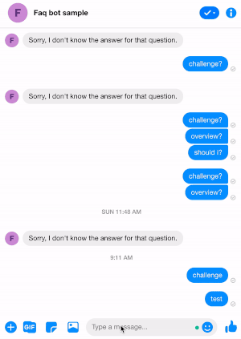

Congratulations! You have successfully created FAQ-bot using messenger and wit.ai.
In this tutorial, we have learned many things such as
preparation, how to make messenger app, how did NLP works, etc.
Hopefully what we have learned can be really useful and you can develop into even cooler things 😁

You can access this project source code on : https://github.com/qornanali/faq-bot.

### What's next?

Of course, this app isn't perfect yet. In the future, you may add:

1. Since ngrok is very limited and it is temporarily for development process, 
therefore we need to deploy the app on server as you wish so that the application always serving
customer questions. You can use Heroku, Azure, AWS, etc. 

2. For now, to add record on the answers table, we are still using the rails console.
If we provide API CRUD (create, read, update, delete) which can be consumed internally,
the process will be even easier.

*Anything else?*

Of course! You can contribute to this repository by following [issues](https://github.com/qornanali/faq-bot/issues)
in this repos.
Any kind of contribution will be accepted! 😁

### Reference

- https://developers.facebook.com/docs/messenger-platform

- https://guides.rubyonrails.org/

- https://wit.ai/docs

- https://ngrok.com/docs

- https://developercircles2020.devpost.com/details/resources

[1]: https://en.wikipedia.org/wiki/Neuro-linguistic_programming

[2]: https://en.wikipedia.org/wiki/Spike_(software_development)
